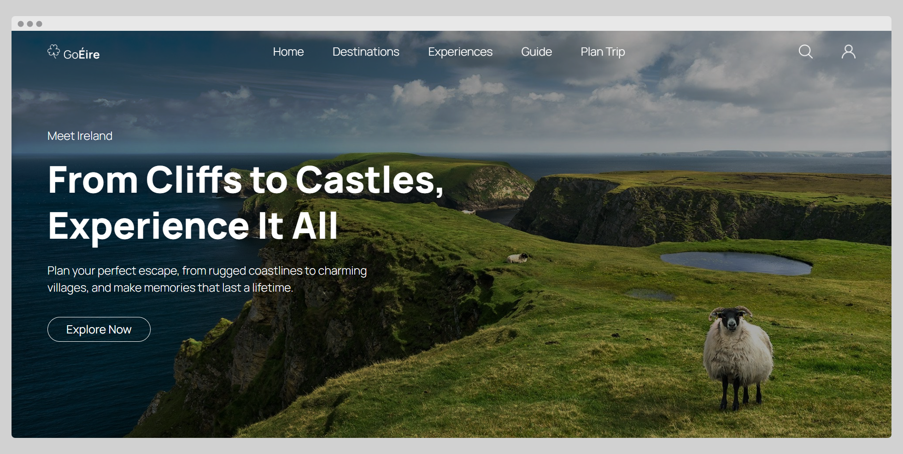
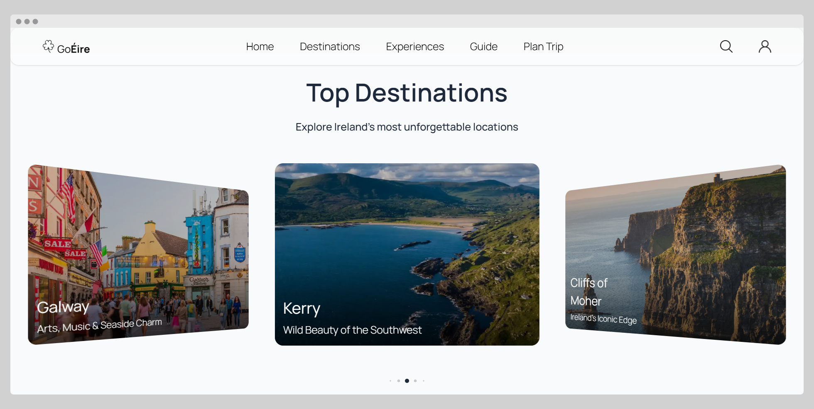
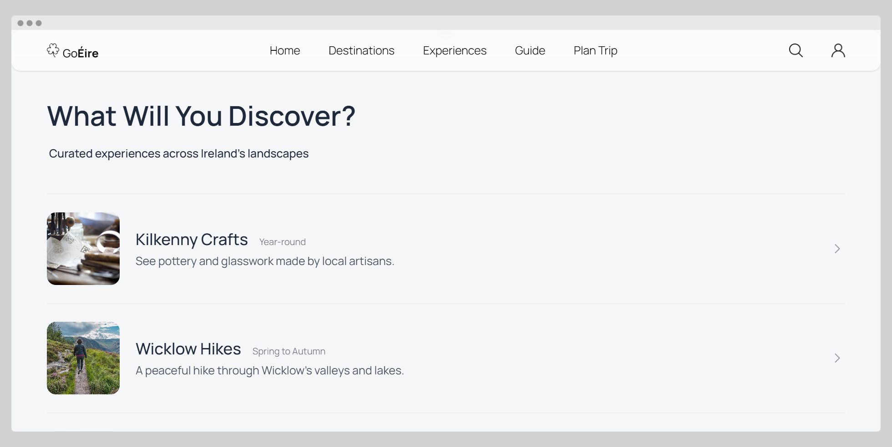
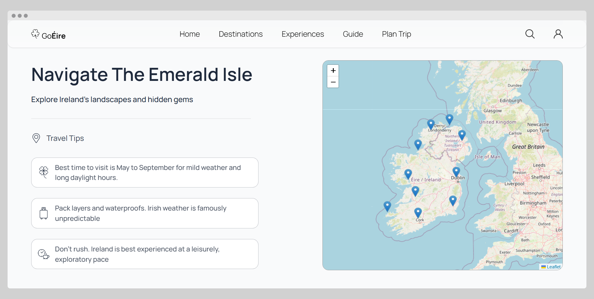
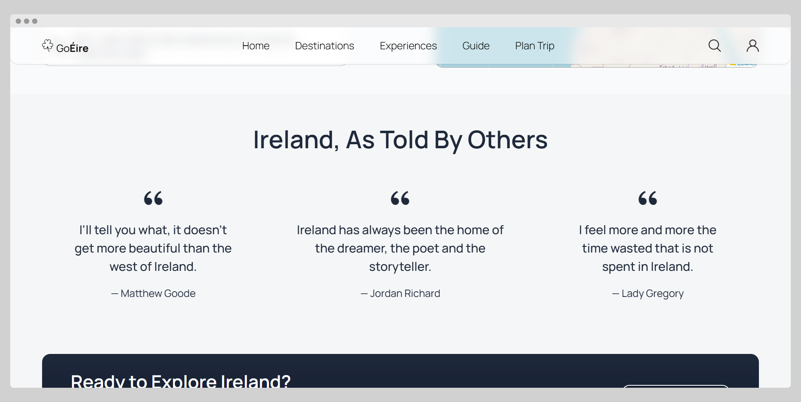
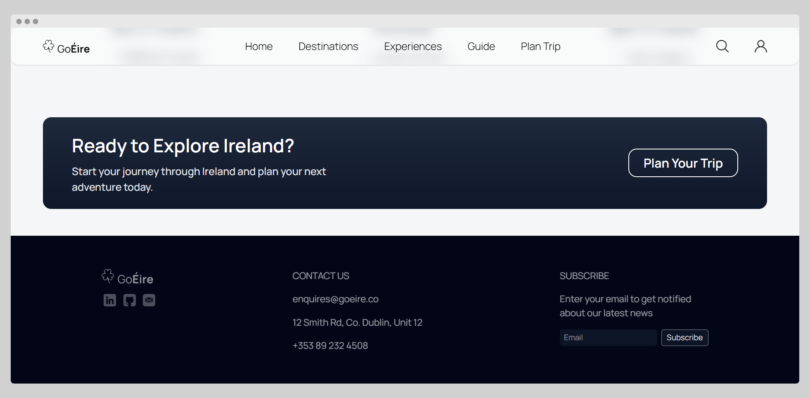
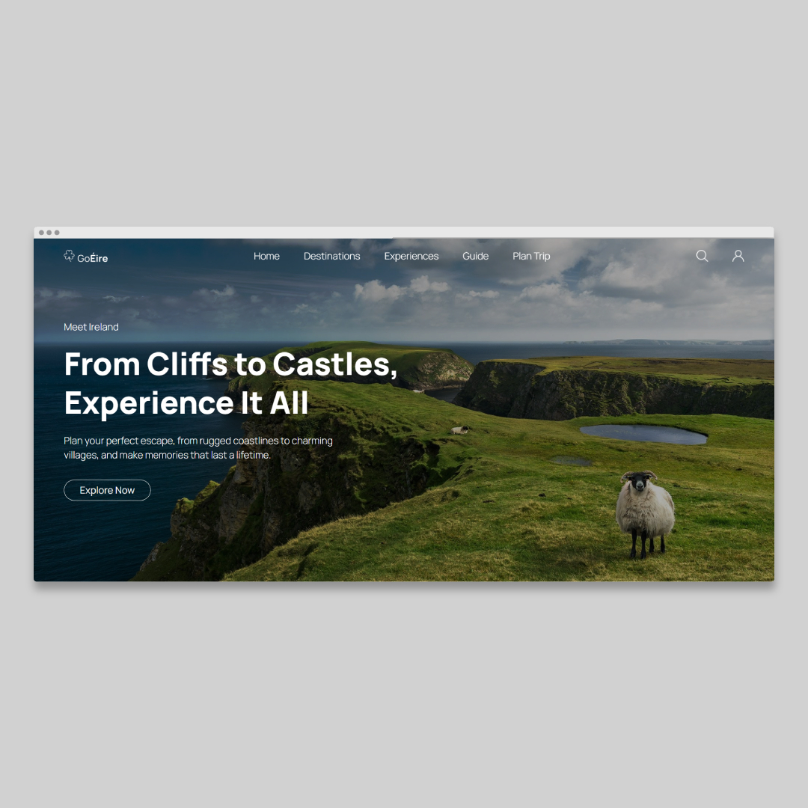
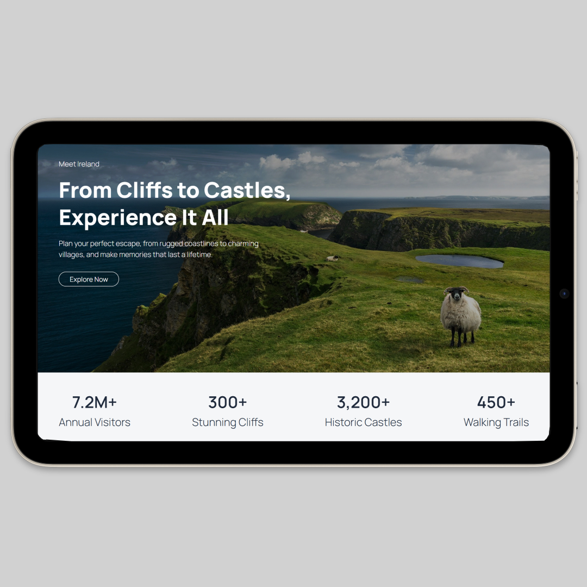
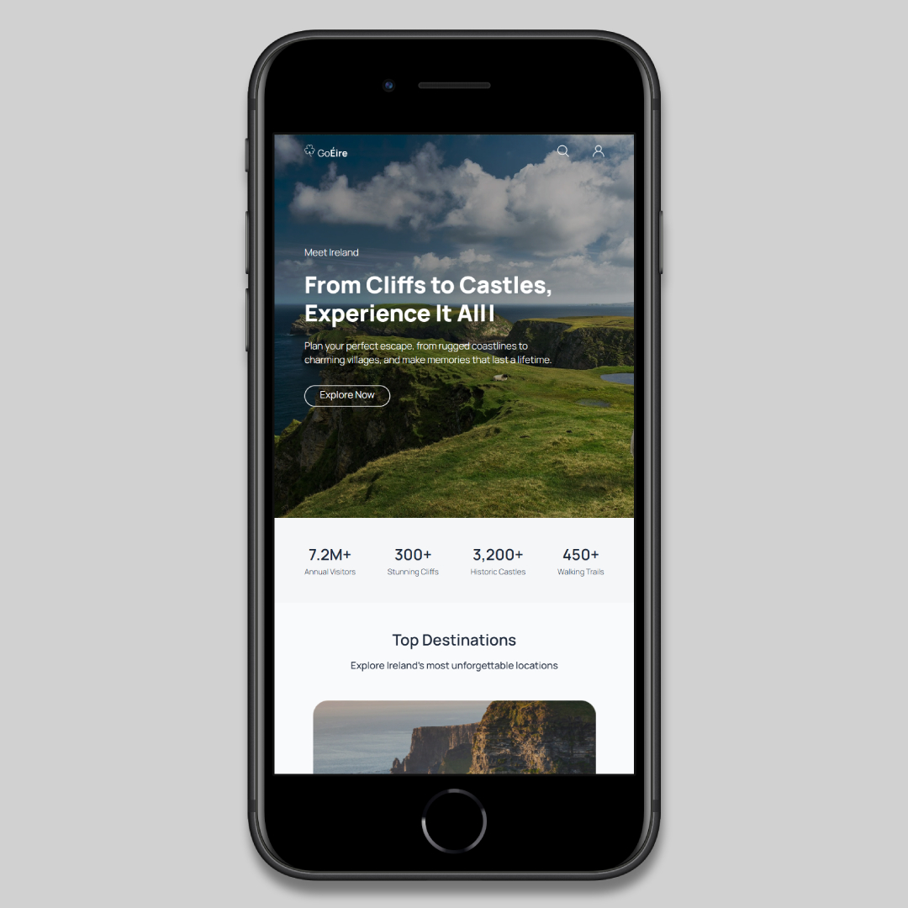

# GoÉire

<table>
  <tr>
    <td width="200">
      
    </td>
    <td>
      <p>
        <b>GoÉire</b> is a frontend built with React for a fully responsive travel website, designed to showcase the beauty and culture of Ireland.  
        It features multiple sections including the Hero, Stats, Destinations, Discover, Navigate and Quotes.  
        The design is clean, interactive, and adapts across desktop, tablet, and mobile devices.
      </p>
    </td>
  </tr>
</table>

---

## Live Site

Check out the site here:  
https://goeire-site.vercel.app/

---

## Screenshots

### Main Sections
<table>
  <tr>
    <th>Hero Section</th>
    <th>Destinations</th>
  </tr>
  <tr>
    <td></td>
    <td></td>
  </tr>

  <tr>
    <th>Discover</th>
    <th>Navigate</th>
  </tr>
  <tr>
    <td></td>
    <td></td>
  </tr>

  <tr>
    <th>Quotes</th>
    <th>Footer</th>
  </tr>
  <tr>
    <td></td>
    <td></td>
  </tr>
</table>

### Responsive Views
<table>
  <tr>
    <th align="center">Desktop View</th>
    <th align="center">Tablet View</th>
    <th align="center">Mobile View</th>
  </tr>
  <tr>
    <td align="center">
      
    </td>
    <td align="center">
      
    </td>
    <td align="center">
      
    </td>
  </tr>
</table>

---

## Tech Stack

- **React.js + Vite** - Frontend framework and setup  
- **TailwindCSS** - Styling with responsive design and utility classes
- **HTML5 & CSS3** - Structure and custom styles  
- **Third-Party Libraries:** AOS, TypeIt, CountUp, Swiper, Leaflet  

---

## Setup Guide

1. Clone the repo:
   
   ```bash
   git clone https://github.com/AntoOfo/goeire-site
   cd goeire-site
    ```
2. Install dependencies:
   
   ```bash
   npm install
    ```
   
4. Run the site locally:
   ```bash
   npm run dev
    ```
